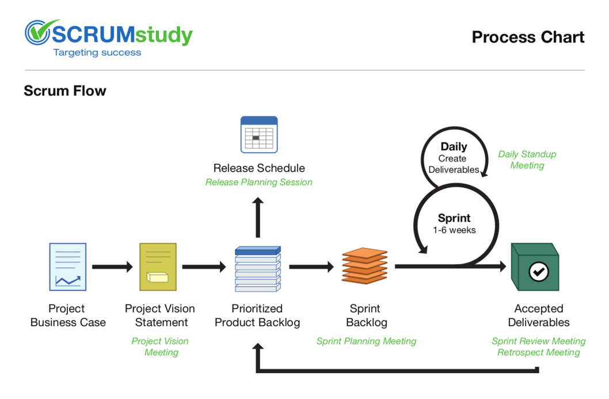
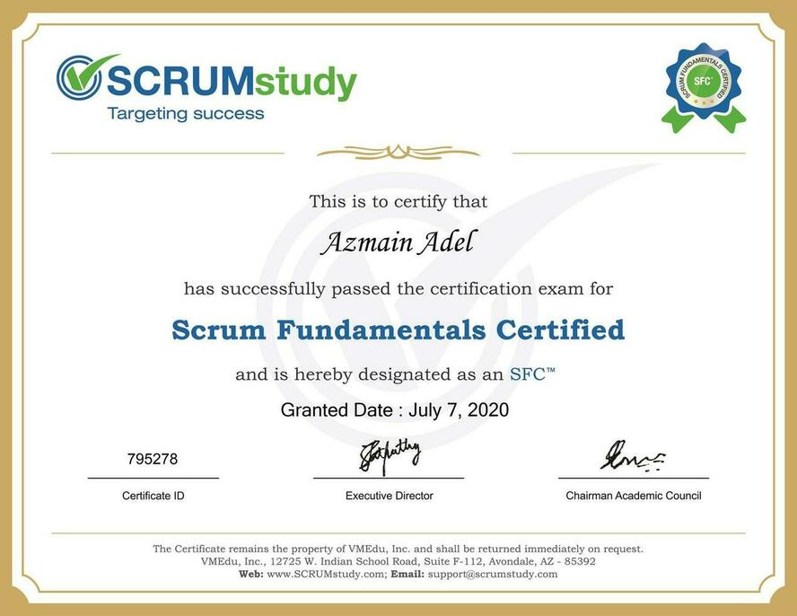

Hello everyone. This will be my walkthrough on how I got the SFC™ certificate.

## Scrum

Most of you have already heard of the term *Scrum*. 

Scrum is one of the most popular *Agile* methodologies. It is an adaptive, iterative, fast, flexible, and effective methodology designed to deliver significant value quickly and throughout a project. Scrum ensures transparency in communication and creates an environment of collective accountability and continuous progress. 

To get the basics, you can watch this short [video](https://youtu.be/aP3TBpWWwJ8).

## SFC?

SFC™ stands for **Scrum Fundamentals Certified**. This certification is provided by [SCRUMstudy](https://www.scrumstudy.com/) which is owned by VMEdu. They have a broad coverage of Scrum certification:

1. Scrum Fundamentals Certified (SFC)
2. Scrum Developer Certified (SDC)
3. Scrum Master Certified (SMC)
4. SCRUMstudy Agile Master Certified (SAMC)
5. Scrum Product Owner Certified (SPOC)
6. Expert Scrum Master Certified (ESMC)
7. SCRUMstudy Certified Trainer (SCT)
8. SCRUMstudy Certified Agile Coach (SCAC)
9. Certified Implementation Expert (CIE)
10. Scaled Scrum Master Certified (SSMC)

SFC is tailored to help anyone interested to know more about Scrum; learn about key concepts in Scrum, and to get a basic understanding of how Scrum framework works in delivering successful projects. 

Although this is a **free certificate**, this provides with the necessary knowledge of Scrum fundamentals.

## What I learned

I always believed that to become a better software engineer, even if you are going to code most of the time during the initial years, knowledge of team & project management is a MUST. This can be gained through experience and what I have understood, that is absolutely the best way to go. But extra knowledge always helps and I wanted to explore an organized methodology of managing projects.

If you are new to the software industry or currently on your final year of graduation, this course will definitely help you.

This certification helped me to learn many topics of such a methodology, Scrum.

If you are to take the exam, you will know these topics anyway. Also, the SBOK guide has described these perfectly. So I am just pointing out the topics I got to learn from studying for the exam.

- The origin story of Scrum
- Benefits of Scrum
- The six Scrum principles
- Scrum Flow
- Scrum Aspects
- Scrum Phases and Processes
- Scrum Scaling
- The 19 fundamental Scrum processes, along with inputs and outputs
- Scrum Roles

## Getting the certification

#### Registration

To get access to the course contents and exam portal, you need to register on the [SCRUMstudy registration page.](https://www.scrumstudy.com/Account/Register)

You will get access to a student portal where you will find the course contents, downloadable study materials, exam portal and other necessary stuff.

#### How and what to study?

Now this is a tricky part. 

First, let's see the official guideline to prepare for the exam:

1. Attend the instructor-led training webinar
2. Watch the course videos and take test exams on SCRUMstudy student portal
3. Study the SBOK guide

For only the SFC this is way too much. But, to know Scrum and become a master, do follow all of the above methods.

I personally found it hard to keep concentration during the 4-hour webinar. Also, the timezone of Bangladesh was a problem as I had to sit through boring lectures from 9 PM to 1:30 AM including breaks. As the training presentation slides will be provided beforehand, reading that should cover the webinar in my opinion.

So, the primary study material will be the course videos and the SBOK guide. Watch the videos and read the relevant topics from the guide book. As the SFC covers the key concepts and principles of Scrum, you do not need to finish the whole book for this certification. I finished the videos on a weekend and took another couple of days to study the SBOK guide to get the confidence for attending the exam.

#### The exam

The format of the exam is as follows:

- Multiple choice
- 40 questions
- One mark awarded for every right answer
- No negative marks for wrong answers
- 30 questions need to be answered correctly to pass
- 60 minutes duration
- Online unproctored exam

If I had to rate how tough the exam was, I would give it 4/10. In other words, easy!

But, please do not attempt the exam without studying. Actually this study beforehand will benefit you the most as knowing and understanding Scrum will help in the long run.

#### Certificate

After finishing the exam successfully you will get your SFC certificate. Keep it clean and tidy, forget about it, show it off or do whatever you seem is sensible. 

**Remember, the knowledge you earn is your biggest achievement.**

By the way, here is the one I got today!

---
Thanks for reading. 

Please do leave a comment or knock me if have any query regarding this post.
Stay home, stay safe.