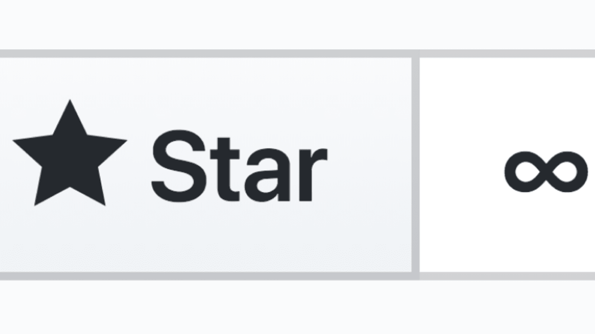

First things first, finding resources as a software developer or a CS student is tough. This doesn't mean that there aren't enough resources. Actually, there are way too many resources which can be overwhelming while searching for a library or tutorials or sample demo projects, etc.

GitHub is the best place for frameworks, libraries, projects, documentation, and collections of many things. 

Here I've listed some GitHub repos that might interest you. I've found these from reading articles, study purposes, suggestions from other people, random repo surfing adventure, and from the curiosity of learning new tools & frameworks. 

You can  learn and build new things, study for interviews and make yourself a better developer from these. This is not only for software developers, This is not only for software developers, but CS students can also gain something from this list. Hope this helps.

## [Awesome](https://github.com/sindresorhus/awesome)

**Stars: 136,402**

What is awesome? Only awesome is awesome. This is the unofficial wiki of the most awesome GitHub repositories. The awesome lists include tutorials, libraries, documentation, etc.
See how many times I used the word 'awesome'? Well, this repo is truly awesome.

## [Free Programming Books](https://github.com/EbookFoundation/free-programming-books)

**Stars: 153,330**

Alongside a huge collection of programming-related books, this repo has free online courses, interactive programming tutorials, programming podcasts, etc. 

Moreover, there is support for many languages. A must-have repo.

## [Coding Interview University](https://github.com/jwasham/coding-interview-university)

**Stars: 124,073 **

From the repo creator's own words who got hired by *Amazon* after following this study plan,

"This is my multi-month study plan for going from a web developer (self-taught, no CS degree) to software engineer for a large company. This is meant for **new software engineers** or those switching from software/web development to software engineering (where computer science knowledge is required)."

That sums it up really well. Follow this repo and study hard.

## [Tech Interview Handbook](https://yangshun.github.io/tech-interview-handbook/)

**Stars: 43,619 **

**GitHub: https://github.com/yangshun/tech-interview-handbook**

This is a wonderfully curated repo that will help you with not just the technical studies, but also in applying for jobs, resume writing, interview processes, behavior tips, etc. This has *practical* content that covers all phases of a technical interview, from applying for a job to passing the interviews to offer negotiation. A must-have.

## [System Design Primer](https://github.com/donnemartin/system-design-primer)

**Stars: 101,127**

The absolute best resource for learning how to design scalable systems. System design is a broad topic. There is a vast amount of resources scattered throughout the web on system design principles.

This repo is an organized collection of resources to help you learn how to build systems at scale.

## [Build Your Own X](https://github.com/danistefanovic/build-your-own-x)

**Stars: 76,949**

The first thing on the repo,

*"What I cannot create, I do not understand"* - Richard Feynman

Prefer learning a new language, framework, game engine by practical usage first? Then this repo if for you. This is a great collection of video tutorials, articles grouped by the 'X' technology you love.

## [Free For Dev](https://github.com/ripienaar/free-for-dev)

**Stars: 36,264**

This is a list of software (SaaS, PaaS, IaaS, etc.) and other offerings that have free tiers for developers. Need some free services or APIs or dev tools for your pet project? Search for it here and most of the time you will be lucky.

## [Developer Roadmap](https://github.com/kamranahmedse/developer-roadmap)

**Stars: 113,994**

The roadmap to becoming a (web) developer in 2020. You will find a set of charts demonstrating the paths that you can take and the technologies that you would want to adopt in order to become a frontend, backend, or a DevOps engineer.

**Do check out another great repo by the same author: [Design Pattern for Humans](https://github.com/kamranahmedse/design-patterns-for-humans)**

## [The Art of Command Line](https://github.com/jlevy/the-art-of-command-line)

**Stars: 78,032**

Whatever your environment is, whether you are developing or doing some research-work, the command line is something you face every day. Fluency on the command line is a skill often neglected. This is a selection of notes and tips on using the command line in subtle ways.

## [Public APIs](https://github.com/public-apis/public-apis)

**Stars: 88,860**

A great list of free APIs for use in software and web development. Build demo apps, test your systems, play with data by calling these free APIs. They're here for you.

## [Awesome Interview Questions](https://github.com/MaximAbramchuck/awesome-interview-questions)

**Stars: 34,775**

Feeling confident after studying so much? This repo will help you in understanding what types of questions are asked during tech interviews. The grouped list and the huge collection will help you practice and enrich your knowledge.

## [Papers We Love](https://github.com/papers-we-love/papers-we-love) 

**Stars: 41,091**

This repository serves as a directory of some of the best papers scattered across the web on academic computer science. The contributors from around the world have created a beautifully curated list on many fundamental and modern topics.

## [The Algorithms](https://github.com/TheAlgorithms)

**Stars: 125,000+**

This is actually not a single repo. This is a collection of repos that includes almost every data structure and algorithm implemented in multiple languages like *Java, C++, Python*, etc.

## [Pure Bash Bible](https://github.com/dylanaraps/pure-bash-bible)

**Stars: 24,954**

This repo includes commonly-known and lesser-known methods of doing various tasks using only built-in `bash` features. Using the snippets from this repo can help remove unnecessary dependencies from scripts and in most cases make them faster.

## [Boilerplates for Mobile Devs](https://github.com/SimpleBoilerplates)

**Stars: 2,500+**

This repo has boilerplate projects for Android, iOS, Flutter, React mobile app development. This one is not very popular but I found this really useful.