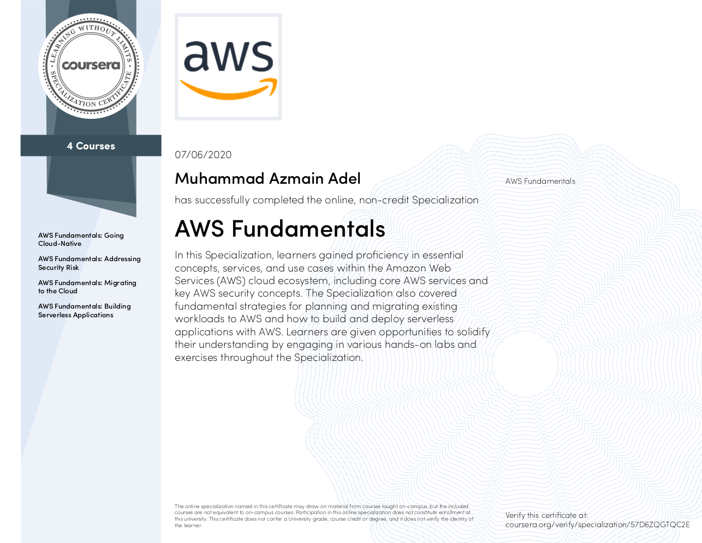

I recently completed the four-course AWS Fundamentals specialization on Coursera conducted by the AWS team. Beginners can start this one but some basic backend and system design knowledge are necessary.

Link to the course:
<a href="https://www.coursera.org/specializations/aws-fundamentals" target="_blank">AWS Fundamentals Specialization</a>

---

---

Brief Introductions to the four courses:

#### **Going Cloud Native:** 

This course will introduce you to AWS core services and infrastructure.

Topics: *EC2, S3, VPC, Gateways, ELB, EFS, EBS, Lightsail, RDS, DynamoDB, Cloudwatch.*

#### **Addressing Security Risks:** 

This course will give you an overview of security best practices when developing and managing applications on AWS.

Topics: *AWS Shared Responsibility Model, Security Hub GuardDuty, Secrets Manager, IAM.*

   
#### **Migrating to the Cloud:** 

This course focuses on analyzing your current environment, planning your migration, AWS services that are commonly used during a migration, and the actual migration steps.
There are optional lab works but access to that is limited to paid enrolled students. Thanks to BUET I got a paid Coursera access.

Topics: *DMS, Migration policies, Direct Connect*, etc.

   

#### **Building Serverless Applications:** 

This course will introduce you to the AWS serverless architecture. Through demonstrations and hands-on exercises you'll learn skills by building and deploying a serverless website & a chat bot.

Topics: *Lambda, API Gateway, Cloudfront, DynamoDB, Lex, Poly.*
