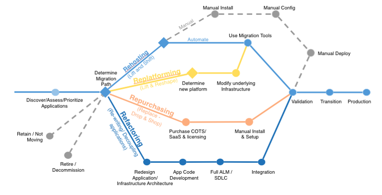

## Strategies for Cloud Application Migration

> “How emigration is actually lived — well, this depends on many factors: education, economic station, language, where one lands, and what support network is in place at the site of arrival.” -Daniel Alarcón

### 1. Re-host

*Lift and shift*

This is moving your application from one host to another **without making any changes**. This migration is usually done by large-scale, business-oriented organizations who want to migrate their application quickly to meet business objectives. These migrations are mostly done by automated migration tools.

Similar to `Ctrl+X` and then `Ctrl+V`

### 2. Re-platform

*Lift, modify and shift*

This is moving your application from one host to another and **making some changes**. Let's say you are moving your large-scale application to another cloud platform and want to change the DB while you are at it. This will be considered re-platforming.

### 3. Refactor/Re-architect

*Change the existing environment*

**Redesign the architecture** of your application driven by a strong business need to add new features or upgrade performance. This is performed when the requirements are difficult to achieve in the current architectural states.

An example can be moving from monolithic architecture to microservices.

### 4. Re-purchase

*Move to a new product*

This migration commonly refers to **moving to the SaaS** (software-as-a-service) model. This is changing perpetual licenses to services that will make the application more robust. 

For example, using *salesforce.com* instead of manual CRM.

### 5. Retire

*Get rid of*

This means **removing or turning off applications** that are no longer functional. These savings can boost your business case, direct your team’s attention to the applications people use.

### 6. Retain/Revisit

*Keep that matters the most*

This means **keeping the applications that are vital** to the system or not migration priority to and migrating the others through re-platforming or refactoring. One should only migrate what makes sense for the business.

------

Image taken from [AWS Migration Whitepaper](https://aws.amazon.com/whitepapers/)

