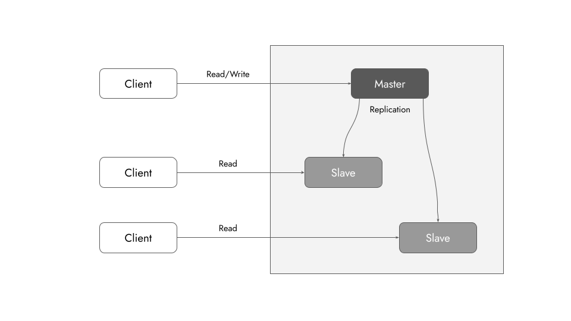
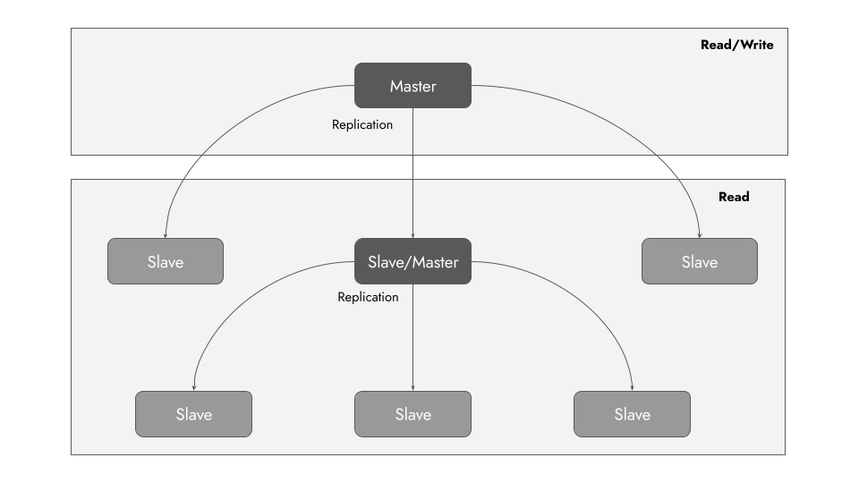
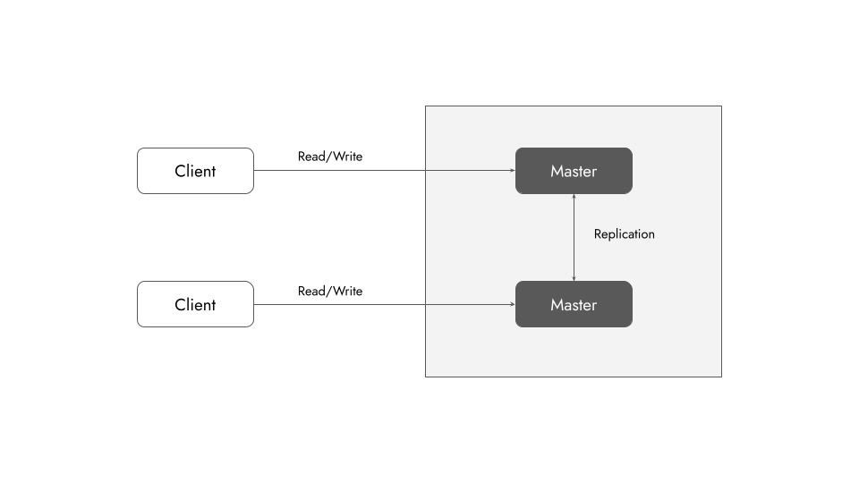
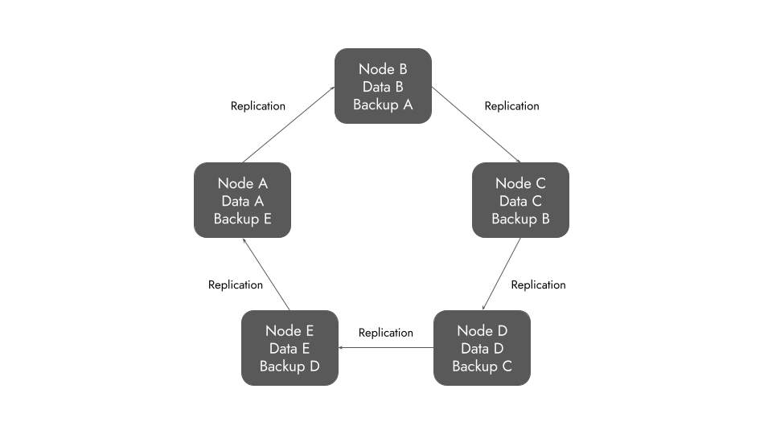
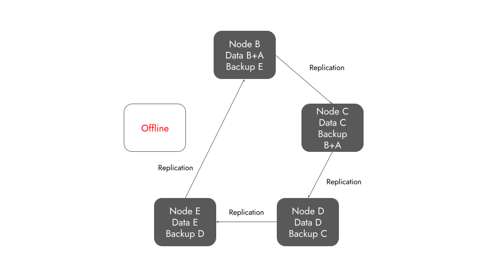

### Brewer's CAP Theorem

In theoretical computer science, the CAP theorem, also named Brewer's theorem after computer scientist Eric Brewer, states that **any distributed data store can only provide two of the following three guarantees**:

1. **C**onsistency:
Every read receives the most recent write or an error.
2. **A**vailability:
Every request receives a (non-error) response, without the guarantee that it contains the most recent write.
3. **P**artition tolerance:
The system continues to operate despite an arbitrary number of messages being dropped (or delayed) by the network between nodes.

In a distributed database system, we have network partitions (P in CAP) by default.
So we get to pick only one of
* **A**vailability
* **C**onsistency

In this post, I am focusing on the AP combination and I will briefly discuss availability is ensured using database replication.

### Availability using Replication

Availability in a distributed system ensures that the system remains operational 100% of the time. Every request gets a (non-error) response regardless of the individual state of a node.

There are two types of database replications:
1. Active replication - **Push**
2. Passive replication - **Pull**

#### Active Replication

In active replication each client request is processed by all the servers. So all of the distributed data storage gets updated *actively*.

#### Passive Replication

In passive replication there is only one server (called primary) that processes client requests. After processing a request, the primary data storage updates the others *passively*.

How do the data stores do this?

### Passive Replication Methods

* Master-Slave replication
* Tree replication
* Master-Master replication
* Buddy replication

#### 1. Master-Slave Replication

A generic replication method.

* Master (primary storage) gets the latest data.
* Slaves (secondary storages) replicate the data internally.

#### 2. Tree Replication

A structure similar to a tree is maintained. In this case, all the parent nodes are masters and the child nodes are slaves.

* Master (tree root) gets the latest data.
* Child masters and their slaves replicate the data internally.

#### 3. Master-Master Replication

Every storage is maintained as primary or master.

* Every master storage can get latest data.
* They replicate each other to stay updated.

#### 4. Buddy Replication

A ring topology of data storage servers.

* Each node stores the backup of the previous node on the chain.
* The backup is performed using replication.

**But what if a node goes offline?**

The solution is easy.

* Store extra backup.
* Update the replication chain.

---

Hero image taken from [unDraw](https://undraw.co/)
